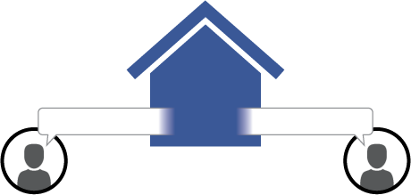
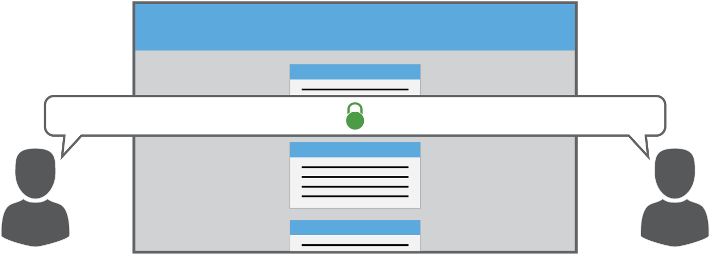
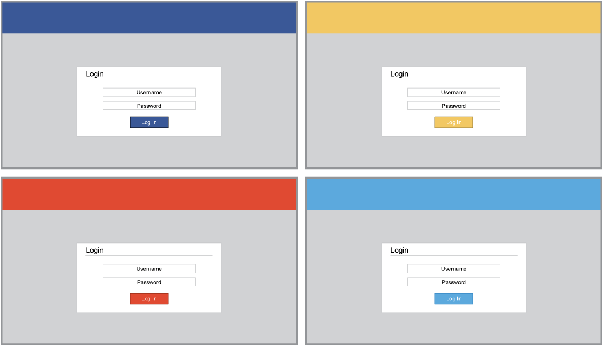
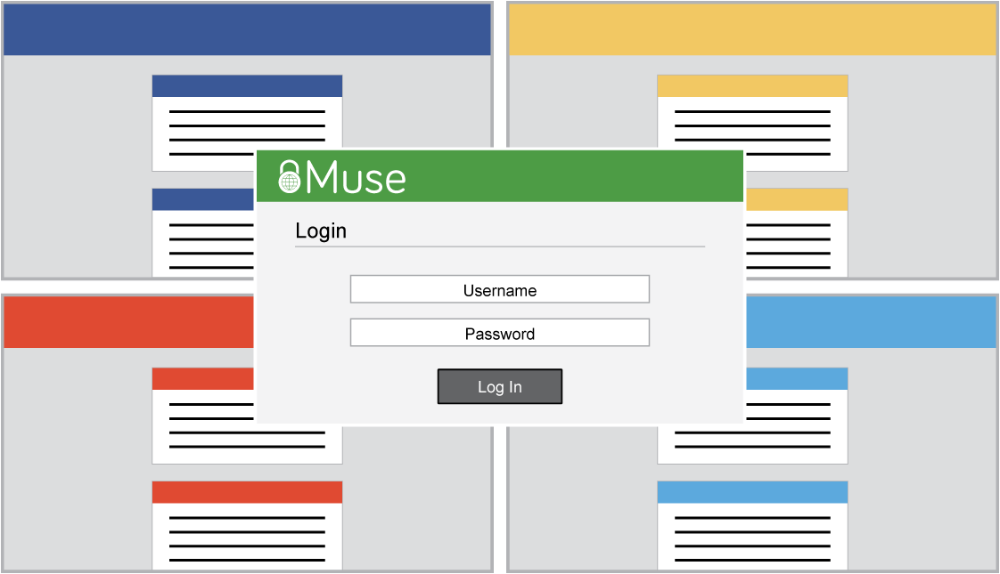
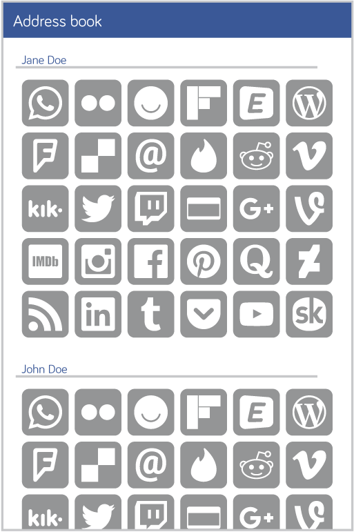
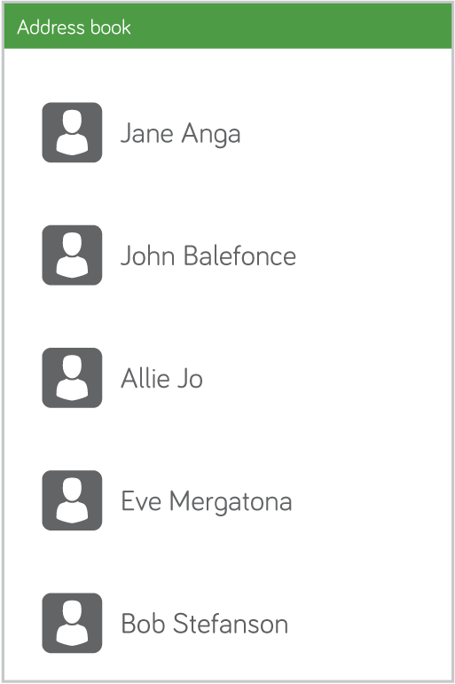

# Muse protocol overview

**Description:** Muse is an encrypted content and sharing management protocol that gives you all the convenience of the cloud with none of the privacy concerns.

**How it works:** Most of the web today is public by default. When you upload something, it's like you're putting your mail in a shared mailbox and trusting the other 3 billion mailbox users not to look. And though sites like Facebook and Google use accounts to give everyone their own individual mailboxes, as the postmen, they're free to snoop at will.

The Muse protocol changes that. Unlike websites, Muse doesn't protect your privacy with vague promises -- it protects your privacy with the same strong encryption used by governments and banks. You log in once to Muse (no more remembering countless passwords!), and applications connect to the internet through the protocol service. From there, you have full control of what data goes online and who you share it with.

Unlike traditional web applications, Muse apps can always be accessed offline (though some functionality may be unavailable). Not just that, depending on the implementation service, they can switch seamlessly between local networks and the internet, enabling fine-grained control over data dissemination.

Muse's first application, a modernized email replacement called Ethyr, will be hitting Kickstarter soon. More details are available at [https://ethyr.net](https://www.ethyr.net).

# Protocol explanation graphics

Most websites today offer, at best, to protect your data from other people on the web, while they themselves read anything they want.

------------

Muse, on the other hand, protects your information from the moment you create it until the moment it's read. No one in between -- not even advertisers -- can access your data.

------------

Websites have single-purpose logins that force you to remember usernames and passwords from every site you visit.

------------

Your Muse service has a single username and password for all applications, and unlike "Sign in with (website)", different applications can't share any information without your permission.

------------

On the web, it's tough to know exactly how to talk to someone, or even what your options are. There are countless sites out there, and each one goes to a different inbox.

------------

With Muse, if you want to send someone a message, there's only one place to go. It's all going to the same place, and every application has the same inbox.
