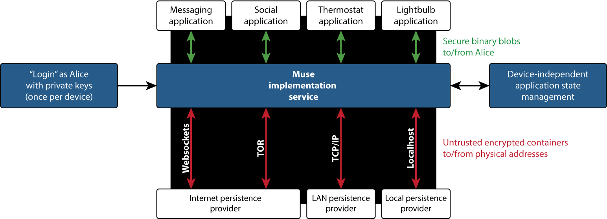

**Shameless plug:** We're dangerously low on funding and are [on IndieGoGo](https://www.indiegogo.com/projects/ethyr-modern-encrypted-email) through 12 Feb 2016 with a proof-of-concept Muse application.

**Warning:** this repo is considered public pre-release information and is in varying levels of completeness. If you have questions or comments, please [contact us](mailto:badg@muterra.io).

# I don't have time to read your whole readme

Muse is an open social protocol that uses encryption to protect individual privacy on unknown, untrusted servers.

It is currently under development by [Muterra, Inc](https://www.muterra.io), co-evolving with the [Ethyr](https://www.ethyr.net) secure email system. More information about Muse, Muterra, and Ethyr can be found at our [blog](https://www.muterra.io/blog). If you'd like to stay updated, consider joining the Muterra [mailing list](https://www.muterra.io/mailing-signup.html).

> What is a "social protocol"?

By "social protocol", we mean something that mediates between "Alice" and her IP address, regardless of which device(s) she uses.

> What exactly *is* Muse?

Muse manages identity, content, and sharing at a protocol level. It defines 

1. How to digitally represent the entity Alice
2. How Alice creates private content
3. How Alice shares that content

Muse is a shared, consolidated social infrastructure that addresses those problems [without overhead](http://blog.rust-lang.org/2015/05/11/traits.html) and doesn't require trusted servers.

> What is this an alternative to?

Trusting a third party server with account management, identity verification, etc. You get all the convenience of the cloud with none of the privacy and security concerns. It isn't replacing any one protocol, it's a total retooling of social application creation.

> What's an example use-case?

Our [demonstration application](https://github.com/Muterra/doc-ethyr) is a private "email" (not SMTP) service with a very powerful API. The protocol handles the addresses, the sending, and the storage; all that the email service needs to do is define a message format and a UI.

A planned future development is a Dropbox clone that fluidly transitions between local, LAN, and internet storage. The protocol (implementation) handles the local/LAN/internet, as well as security and account management, and all the application needs to do is manage folder state.

> How would it apply to, say, Yelp?

Yelp would be relieved of the vast majority of account management. Yelp defines their account API (```profile picture```, ```name```, ```location```, etc), and everything else with account management magically works. The protocol manages credentials and authentication; Yelp never handles usernames or passwords.

Along these lines, Muse mostly eliminates user acquisition as a pain point: once someone creates an account for any service on the Muse network, they can use those credentials for any other service. 

There's a single point of contact for everything on Muse. Yelp itself has a single "mailbox", the bar down the street has a single "mailbox", and the disgruntled reviewer has a single "mailbox". A Muse-powered Yelp app doesn't have to worry about how data gets from point A to point B, it just magically does, at no cost to application development.

Most crucially, the Muse protocol protects privacy for everyone involved, at no cost to application development. In a world of very high profile attacks against large corporations, this is an enormous risk reduction.

# Okay, still listening

In practice, the Muse application stack looks like this:



The goal of the protocol is to give any Muse application a device-independent, cryptographically-enforced, private-by-default representation of:

1. an entity, such as Alice (*identity management*)
2. the content that this entity creates (*content management*), and
3. the process to share that content (*sharing management*).

Muse itself is asynchronous, transport agnostic, and [limited in scope](http://blog.rust-lang.org/2015/05/11/traits.html). This allows a device's protocol implementation service to dynamically propagate content across any transport infrastructure with an available asynchronous buffer service. These *persistence providers* may be used for indefinite-length storage, and objects are garbage collected only when freed from use. An individual persistence provider may operate over an arbitrary number of physical data transports, but must support a common command set to be Muse-compliant.

Taken as a whole, the Muse stack allows applications to be simply and securely developed on a common social infrastructure. This alleviates the need for costly user acquisition while drastically improving individual privacy and decreasing application security footprints.

# What does Muse do differently?

Muse is an overlay network standard that encrypts everything *not just from device to device*, but from entity to entity. The protocol assumes that all transported data is vulnerable, relying only on universal encryption to limit data access. Applications built on Muse can therefore addresses communications directly between the participants' digital identities (essentially their public keys) without regard to the transport layer. Protocol implementations then distribute that information to transport-specific persistence providers, who deliver it to the conversation partner as soon as she is available.

More concretely, and using TCP/IP as an example, most existing transports are *network-oriented*:

    1. (Bob at 73.36.202.142) sends (www.gmail.com at 173.194.33.149) "Alice: we're out of toilet paper"
    2. (Alice at 88.41.145.167) asks (www.gmail.com at 173.194.33.149) for new messages
    3. (www.gmail.com at 173.194.33.149) responds with "From Bob: we're out of toilet paper"
    4. (Alice at 88.41.145.167) sends (www.paypal.com at 66.211.169.66) "withdraw money from Alice's bank account"
    5. (www.paypal.com at 66.211.169.66) sends (www.wellsfargo.com at 159.45.2.145) "withdraw money from Alice's account"
    6. (Alice at 88.41.145.167) sends (www.amazon.com at 72.21.206.6) "Alice orders TP"

The Muse protocol divides this into two strictly separated processes. Applications are *agent-oriented*:

    1. (Bob at <bobkey>) sends (Alice at <alicekey>) "We're out of toilet paper"
    2. (Alice at <alicekey>) tells (Paypal at <paypalkey>) to withdraw money from her bank account
    3. (Paypal at <paypalkey>) asks (<Wells Fargo at <wellskey>) to withdraw from Alice's account
    4. (Alice at <alicekey>) orders TP from (Amazon at <amazonkey>)

Meanwhile, protocol implementations transparently pass this conversation across content-agnostic, network-oriented physical transports, storing files in pluggable persistence providers:

    1. 73.36.202.142 sends <encrypted blob with ID=hash1> to (persistence provider at 55.194.11.158) 
    2. 88.41.145.167 requests <encrypted blob with ID=hash1> from (persistence provider at 55.194.11.158)
    3. 88.41.145.167 sends <encrypted blob with ID=hash2> to (persistence provider at 55.194.11.158) 
    4. 66.211.169.66 requests <encrypted blob with ID=hash2> from (persistence provider at 55.194.11.158)
    5. 66.211.169.66 sends <encrypted blob with ID=hash3> to (persistence provider at 55.194.11.158) 
    6. 159.45.2.145 requests <encrypted blob with ID=hash3> from (persistence provider at 55.194.11.158)
    7. 88.41.145.167 sends <encrypted blob with ID=hash4> to (persistence provider at 55.194.11.158) 
    8. 72.21.206.6 requests <encrypted blob with ID=hash4> from (persistence provider at 55.194.11.158)

# Why is this better?

+ **Protocol-protected individual agency.** This is a more meaningful benefit than platform-independent privacy; cloud-stored information is unavailable to anyone you don't explicitly share with, including the cloud owner.
+ **Application-independent content security.** The protocol can't guarantee applications are running safe code, but it separates content authenticity, integrity, and confidentiality enforcement into open-source, vetted protocol implementations that are independent from the applications built on them.
+ **Hosting modularity.** Container format is standardized, minimizing switching costs between hosting providers. Each file transfer takes exactly two API calls.
+ **Transport flexibility.** Muse applications don't deal directly with the transport layer. This job is left to protocol implementations. Applications can switch between implementations seamlessly, making cross-transport redundancy incredibly simple for application developers. This also makes it substantially easier to experiment with new transport technologies.
+ **Application agility.** Instead of getting bogged down in incredibly difficult network implementation details, applications can focus on their core value propositions.
+ **Personal identity management.** Identity, *including usernames and passwords*, are synchronized across the entire protocol. If you only want one identity, you only need one set of credentials -- for any and all Muse applications.
+ **Anonymous, pseudonymous, and eponymous identities coexisting.** Identities carry no inherent physical meaning. Applications are free to place restrictions on verification (ex: your bank needs to know it's you), but this is handled elsewhere. The protocol itself supports anything.

If you want to know more in easily-digestible, not-heavily-technical chunks, now would be a good time to check out our [blog](https://www.ethyr.net/blog/tag/muse.html).

# How does Muse work?

This outlines, from first principles, the protocol design decisions that lead to the Muse. This does not justify our answers -- for that, read our [whitepaper](/whitepaper.md). However, it does explain the entire protocol architecture.

1. **Problem:** What is content?  
   **Solution:** Content is any arbitrary binary data. All content is encapsulated within containers that assure confidentiality, integrity, and authenticity.

    1. **Problem:** How does an agent assure confidentiality?  
       **Solution:** Encrypt the container content.

        1. **Problem:** How should content be encrypted?  
           **Solution:** It's of arbitrary length, so definitely symmetrically (as per usual!)
        2. **Problem:** How does another agent access the encrypted file in a many-to-many network?  
           **Solution:** Use a *separate* key-sharing mechanism (see below).

    2. **Problem:** How does an agent assure integrity?  
       **Solution:** They hash the encrypted container.
    3. **Problem:** How does an agent assure authenticity?  
       **Solution:** They asymmetrically sign the container hash.
    4. **Problem:** How is the content identified on the network?  
       **Solution:** All containers are deterministically and uniquely content-addressed. In other words, content is identified by a collision-resistant cryptographic hash.
    5. **Problem:** How can this data be made asynchronously-available?  
       **Solution:** Any Muse-implementing network requires a persistence system. These are transport-specific. A conformant physical network node stores data on agents' behalf(s). Nodes may also bridge between transport-specific Muse implementations to automatically sync network state between them. Uploading is implicit, and the persistence system must understand several commands defined within the Muse spec.

        1. **Problem:** What commands must a persistence system accept?  
           **Solution:** Publish, get, subscribe, unsubscribe, ack, nak, list node subscriptions, list object binders.
        2. **Problem:** How are these persistence systems standardized?  
           **Solution:** Each particular transport mechanism defines its own overlay standard for command format.

    6. **Problem:** How does the persistence system know to retain data?  
       **Solution:** Agents bind addresses to objects, reminiscent of a "call-by-assignment" programming language. Bindings may be created by any agent, regardless of data authorship. This prevents problematic deletion. Objects are always static, but bindings may also be dynamic (which creates a secondary address).

        1. **Problem:** How does the persistence system know when to remove data?  
           **Solution:** When all bindings have been removed through "debind" commands, the persistence system garbage collects the object.
        2. **Problem:** How can an author-agent remove undesired content that has been bound by a different agent?  
           **Solution:** Binding records include the binding agent as public metadata. Persistence systems must include a command to list the agents who have bound to a particular piece of content. The author may then exert social/political/legal pressure on those binders for them to remove the binding.

2. **Problem:** What is sharing?  
   **Solution:** An exchange of symmetric encryption keys.

    1. **Problem:** How is this accomplished in a many-to-many network?  
       **Solution:** Separate the key exchange from the content itself. Content is uniquely and trivially addressable, and access is shared one-to-one between agents. Note that agents may be computational, so public information may be automatically shared across communities of any size.
    2. **Problem:** How do you perform secure online key exchange?  
       **Solution:** Initially, through a special asymmetrically-encrypted handshake object. These are distributed like any other Muse content, but contain a public reference to their agent-target. Unlike standard objects, their author is only named privately, within the container body.
    3. **Problem:** Doesn't this hinge on the secrecy of the target's asymmetric private key? Can we get forward secrecy, etc?  
       **Solution:** Absolutely. The handshake object *could* be used directly for every key exchange, but that would be both insecure and inefficient. The preferred method is to use the handshake to bootstrap a dynamic bidirectional communication pipe between two agents, and then use that for key exchange. The API definition for that key exchange pipe is out-of-scope for Muse itself, but candidates will be defined within overlay standards. Because it is encapsulated within the Muse symmetric pipe, it can be any binary message format.

3. **Problem:** What is an agent?  
   **Solution:** An agent produces, accesses, shares, or retains content.

    1. **Problem:** An agent must be uniquely identifiable and network-available.  
       **Solution:** Put the agent's entire identity within a single, standard content container on the network. These containers are themselves encrypted, so if the identity is public, it must then be bootstrapped (this process is defined in an overlay standard). Use their identity container's content address as their unique identifier.
    2. **Problem:** The agent requires an asymmetric public key for signing content.  
       **Solution:** Add that key to the container file.
    3. **Problem:** The agent requires an asymmetric public key for receiving encrypted pipes.  
       **Solution:** Add that key to the container file.
    4. **Problem:** How does an agent invisibly (to external parties) transition to a new identity?  
       **Solution:** Through a Diffie-Hellman-based identity exchange process.

        1. **Problem:** Can this transition be made selectively deniable?  
           **Solution:** Yes, through clever sequencing of the exchange.
        2. **Problem:** How does an agent perform this exchange online?  
           **Solution:** The DH public key must be made available at the time of identity creation, and is therefore stored with the rest of the identity's public keys (aka: add it to the container file).

    5. **Problem:** Agents are meant to exist independently of physical devices, so they need online private key storage.  
       **Solution:** Out-of-scope, but defined within an overlay protocol.
    6. **Problem:** How does the agent independently discover new content addresses?  
       **Solution:** Out-of-scope.